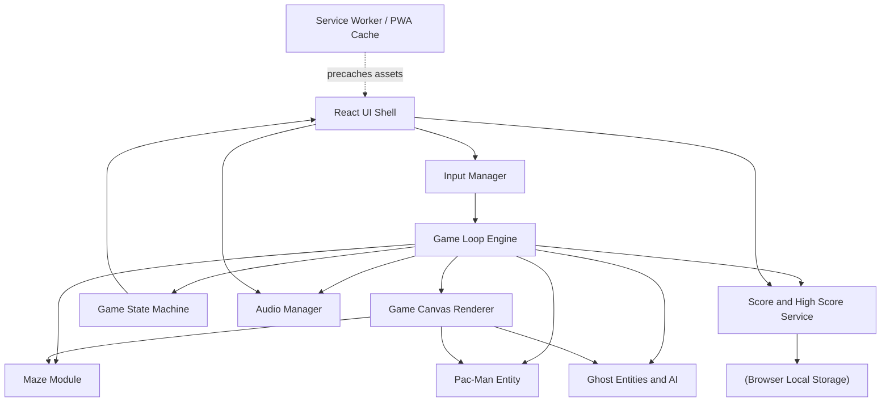

# Architect Mission Report

**Agent**: architect  
**Generated**: 2026-08-19T13:23:04.850Z

---

## Architecture Style

Client-only single-page application (modular monolith running entirely in the browser, no backend server)

## Components

- **React UI Shell** (ui): Top-level React application that composes all screens (Start, Countdown, Pause, Level Complete, Game Over), the HUD, and touch controls. Subscribes to the Game State Machine and re-renders only low-frequency UI (score, lives, screen transitions) to avoid fighting the 60fps game loop.
- **Game Canvas Renderer** (ui): Imperative Canvas 2D renderer mounted via a React ref. Reads the current frame's maze/entity state from the Game Loop Engine and draws the maze, dots, pellets, Pac-Man (with chomp animation), ghosts (with color/scared/eyes states), and bonus fruit every animation frame. Kept outside React's reconciliation to sustain 60fps.
- **Game Loop Engine** (service): Core requestAnimationFrame-driven tick loop. Advances entity positions, resolves collisions with the maze, triggers dot/pellet/fruit/ghost eating events, applies scoring, drives ghost mode timers (chase/scatter/scared), and pushes state transitions to the Game State Machine.
- **Maze Module** (module): Static tile-grid representation of the maze: walls, corridors, dots, power pellets, tunnel warp points, and the ghost house. Exposes collision/lookup helpers used by both the engine and renderer.
- **Pac-Man Entity** (module): Encapsulates Pac-Man's position, current/queued direction, chomp animation frame, and movement rules (continues in last chosen direction until blocked by a wall).
- **Ghost Entities & AI** (module): The four ghosts (Blinky: direct chase, Pinky: ambush ahead of Pac-Man, Inky: flanking, Clyde: chase/random wildcard) plus mode-based target selection (chase/scatter/scared/eaten-eyes), scatter corners, and ghost-house release scheduling.
- **Game State Machine** (service): Manages high-level screen/flow state: Start -> Countdown -> Playing -> Paused -> Level Complete -> Game Over, plus level number and difficulty parameters. Emits state changes consumed by the UI shell.
- **Input Manager** (service): Normalizes keyboard (arrow keys/WASD), swipe gestures, and on-screen directional buttons into a single 'desired direction' signal consumed by the Game Loop. Also handles pause/mute key bindings for keyboard-only accessibility.
- **Audio Manager** (service): Plays all sound effects (dot-eat waka-waka, pellet, ghost-eat, death, fruit, extra life, startup jingle) and the looping siren whose pitch/speed scales with remaining dots and level. Exposes global mute toggle.
- **Score & High Score Service** (service): Tracks current score, lives, extra-life threshold (10,000 pts), and escalating ghost-eat combo (200/400/800/1600). Persists and retrieves the top-10 high score list (with 3-letter initials) via browser storage.
- **Browser Local Storage** (storage): Persists the top-10 high score list between sessions.
- **Service Worker / PWA Cache** (infra): Precaches the app shell, code bundle, sprites, and audio assets on first load so the game is fully playable offline afterward.

## Tech Stack

- **frontend**: React 18 + TypeScript — Explicitly required by stakeholder. React has the largest ecosystem/talent pool for building the UI shell (screens, HUD, menus) while TypeScript catches entity/state bugs (direction enums, ghost modes) at compile time, which matters for a real-time game with many interacting states.
- **rendering**: HTML5 Canvas 2D API (imperative, driven outside React's render cycle) — A tile-based 2D game with 5 moving actors is well within Canvas 2D's performance envelope at 60fps without the ~100KB+ dependency and API overhead of a WebGL engine like PixiJS. DOM/CSS sprites would force layout/reflow work on every tick and don't scale cleanly to 60fps on low-end mobile devices.
- **build tool**: Vite — Vite produces smaller, tree-shaken production bundles critical for the <2MB budget, has near-instant dev HMR, and has first-class PWA tooling (vite-plugin-pwa). CRA is deprecated/unmaintained; a hand-rolled Webpack config adds setup overhead with no benefit for a project of this size.
- **state management**: Plain TypeScript classes for the game engine + React Context/useReducer for UI-facing state (score, lives, screen) — The engine state (positions, directions) changes up to 60x/second; running that through Redux/Zustand/MobX would add subscription overhead and re-render risk for no benefit since the canvas renders imperatively anyway. React Context/useReducer is enough for the low-frequency HUD/screen data, keeping bundle size minimal.
- **audio**: Howler.js — Howler (~7KB gzip) gives reliable cross-browser overlapping SFX playback, audio sprites, and looping/rate control needed for the siren's pitch ramp, with far less boilerplate than hand-writing a Web Audio graph and more reliability than <audio> tags, which struggle with rapid overlapping triggers (waka-waka).
- **backend**: None — fully client-side static SPA — The spec has no multiplayer, accounts, or server-validated scoring — only a local top-10 high score list. Introducing a backend would add deployment/ops complexity the requirements never ask for, violating the goal of shipping a small, fast-loading, offline-capable game.
- **database**: Browser localStorage (no server-side database) — High scores are a tiny (10-entry) structured list needed only on the player's own device. localStorage's simple synchronous API is sufficient; IndexedDB's async complexity and a server database are unnecessary overhead for this data size and single-user scope.
- **auth**: None — no user accounts — The game only asks for 3-letter initials on a high score, not an account. Adding authentication would contradict the proportionality principle and the offline-first requirement.
- **messaging**: None — not required — There is no multiplayer, real-time sync, or cross-service communication; all events occur within a single client tick loop, so a message broker or socket layer would be pure over-engineering.
- **offline/PWA**: vite-plugin-pwa (Workbox-based service worker) — The spec explicitly requires offline play after first load. vite-plugin-pwa auto-generates the manifest and a precache-on-install service worker integrated with the Vite build pipeline, avoiding the maintenance burden of a manually written Workbox config.
- **testing (unit)**: Vitest + React Testing Library — Vitest reuses the exact Vite transform pipeline (no separate Babel/ts-jest config), runs faster, and is Jest-API-compatible, making it ideal for unit-testing ghost AI targeting functions, maze collision, and scoring logic alongside RTL for UI components.
- **testing (e2e)**: Playwright — Playwright natively drives Chromium, Firefox, and WebKit in one test run — matching the cross-browser requirement — and has better support for simulating keyboard input and touch/swipe gestures than Cypress, which is important for validating both control schemes.
- **CI/CD**: GitHub Actions — Free, natively integrated with GitHub-hosted source, and sufficient to run lint/unit/e2e/build and deploy the static bundle — no need for a heavier CI platform for a single-package static app.
- **infra/hosting**: Static CDN hosting (e.g., Netlify/Vercel/GitHub Pages) — The entire app is static assets (JS/CSS/images/audio) with no server logic, so static CDN hosting is the simplest, cheapest option that also satisfies fast global load times. Containers/orchestration would add operational overhead the app never needs.

## Epics

- **EPIC-001** Maze Rendering & Core Board: Build the maze tile grid (walls, corridors, dots, 4 power pellets, tunnel warp, ghost house) and render it on canvas at all supported viewport widths (375px–2560px).
- **EPIC-002** Pac-Man Movement & Controls: Implement Pac-Man's continuous directional movement, wall-stopping, chomp animation, and all three control schemes: arrow keys/WASD, swipe, and on-screen directional buttons.
- **EPIC-003** Ghost AI & Scatter/Chase Behavior: Implement the four distinct ghost personalities (direct chase, ambush, flank, chase/random wildcard), scatter corners, timer-driven chase/scatter alternation, and staggered ghost-house release.
- **EPIC-004** Power Pellets, Scared Ghosts & Eating: Implement power pellet consumption triggering scared state (color change, reversal, slowdown), the end-of-scared flash warning, eaten-ghost eyes returning to the ghost house and respawning, and the 200/400/800/1600 combo scoring.
- **EPIC-005** Bonus Fruit System: Spawn bonus fruit near the center at ~70 and ~170 dots eaten per level, with level-specific fruit type/points, timeout despawn, and collection scoring.
- **EPIC-006** Scoring, Lives & Extra Life: Track score for all point sources, manage 3 starting lives, death/respawn with level dots preserved, and award an extra life at 10,000 points.
- **EPIC-007** Level Progression & Difficulty Scaling: Detect level completion (all dots/pellets eaten), advance to the next level on the same layout with increased ghost speed, shorter scared duration, and more chase/less scatter, across 20+ levels with a difficulty cap that repeats.
- **EPIC-008** Game Flow Screens: Build Start, Countdown (3-2-1-GO), Pause overlay, Level Complete transition, and Game Over screens with keyboard-only navigation and visible focus indicators.
- **EPIC-009** Audio System: Implement all SFX (dot, pellet, ghost-eat, death, fruit, extra life, startup jingle), a looping siren whose pitch/speed scales with remaining dots/level, and a global mute toggle.
- **EPIC-010** High Score Persistence: Maintain a top-10 high score list, prompt for 3-letter initials entry on qualifying Game Over, and persist the list across browser sessions via localStorage; display current and all-time high score during gameplay.
- **EPIC-011** Accessibility & Colorblind Mode: Ensure full keyboard operability for gameplay and all menus, visible focus states, and a colorblind-friendly ghost color palette toggle.
- **EPIC-012** Responsive Layout, Offline Support & Performance Budget: Ensure smooth 60fps play from 375px to 2560px viewports, keep total assets under 2MB, and enable offline play after first load via a precaching service worker.

## Architecture Diagram

