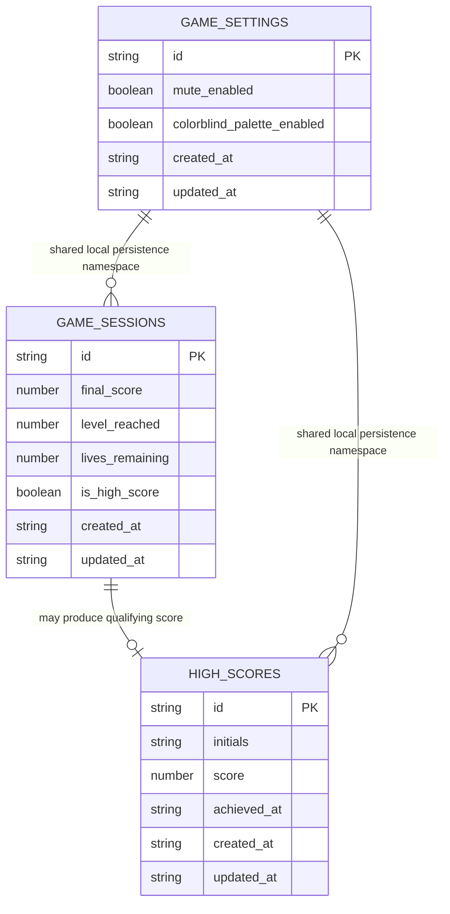

# DBA Mission Report

**Agent**: dba  
**Generated**: 2026-08-19T13:28:32.692Z

---

## Database Engine: Browser localStorage

The architecture and tech stack explicitly specify a fully client-side SPA with no backend server and Browser localStorage as the persistence layer for the top-10 high score list. Because the only durable data is a tiny per-device high score list, a server database would violate the stack decision and add unnecessary complexity. The design therefore models a lightweight localStorage-backed schema with normalized logical entities and JSON-serializable records, while keeping the implementation aligned with the existing ScoreService/storage.ts contract.

## Entities (3)

- **high_scores**: 6 columns
- **game_settings**: 5 columns
- **game_sessions**: 7 columns

## ERD

