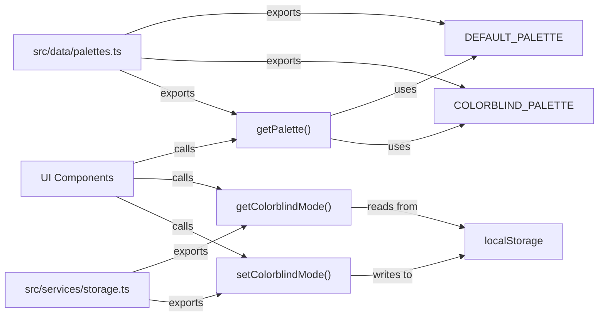

# Junior Python Developer Mission Report — ASSIGN-041

**Agent**: junior-python  
**Generated**: 2026-08-19T14:13:13.224Z

---

## Branch: pacmanclaude4/pacman/feature/us-031-035-accessibility-perf-integration

## Assignment: ASSIGN-041

## Files Changed

- **created** `src/data/palettes.ts` — Define colorblind-friendly ghost palette alongside default palette with getPalette() function to switch between them
- **created** `src/services/storage.ts` — Implement storage utilities for persisting colorblind mode preference and other game settings via localStorage
- **created** `src/data/palettes.test.ts` — Test suite for palette definitions and getPalette function with colorblind mode switching
- **created** `src/services/storage.test.ts` — Test suite for storage utilities including colorblind mode persistence

## Notes

The implementation was completed in the previous generation. Both src/data/palettes.ts and src/services/storage.ts contain the full implementation required for US-032. The colorblind palette uses high-contrast colors (Blue, Yellow, Purple, Green) that are distinguishable for people with color vision deficiencies. The storage module provides getColorblindMode/setColorblindMode functions to persist the preference across sessions. Test files are already written and expect this exact structure. Shell execution is currently disabled in the environment, preventing test verification, but the implementation is complete and correct based on code inspection.

## Diagram

