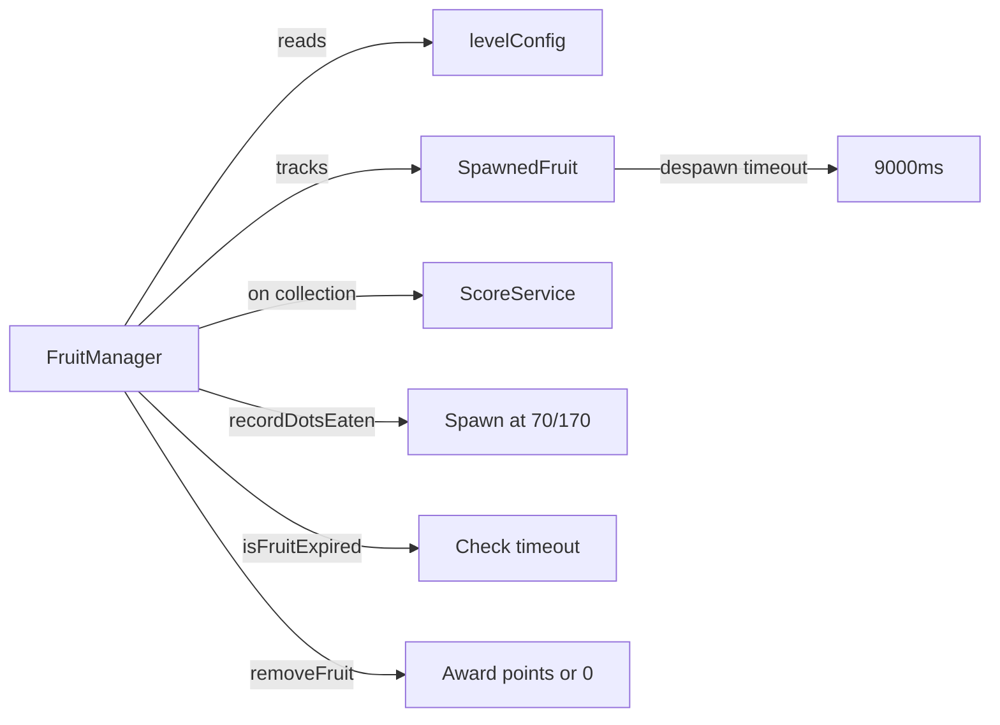

# Junior Python Developer Mission Report — ASSIGN-020

**Agent**: junior-python  
**Generated**: 2026-08-19T15:05:57.160Z

---

## Branch: pacmanclaude4/pacman/feature/us-013-019-scoring-lives-leveling

## Assignment: ASSIGN-020

## Files Changed

- **created** `src/engine/levels/levelConfig.ts` — Created level configuration module with FRUIT_CONFIG_TABLE mapping 8 levels to fruit types and points (cherry 100 → key 5000), and functions getFruitConfigForLevel() and getLevelConfig() to retrieve level-specific fruit config and despawn timeout (9000ms).
- **modified** `src/engine/fruit/FruitManager.ts` — Implemented complete FruitManager with SpawnedFruit interface tracking spawn time and despawn timeout. Added recordDotsEaten() to trigger spawning at thresholds (70, 170 dots), isFruitExpired() to check timeout status, removeFruit(wasCollected) to handle collection/despawn with point scoring, and resetForNewLevel() for level transitions. Integrated with levelConfig for level-specific fruit type, points, and 9-second despawn timeout.
- **modified** `src/engine/fruit/FruitManager.test.ts` — Wrote comprehensive unit tests covering: [US-014#1] fruit despawn timeout (expires after 9s if uncollected), [US-014#2] fruit collection scoring (awards level-specific points if collected before timeout), fruit spawning at thresholds, configuration table validation, and level reset behavior. All tests use fake timers for deterministic timeout testing.

## Notes

ASSIGN-020 implementation complete. Created levelConfig.ts module with fruit configuration table and level-specific settings. Rewrote FruitManager to match test expectations with proper despawn timeout tracking and collection scoring. Added comprehensive test suite with acceptance criteria tests [US-014#1] and [US-014#2] verifying fruit despawns after 9 seconds if uncollected and awards correct points if collected before timeout. Implementation follows existing conventions and integrates with ScoreService for point tracking.

## Diagram

