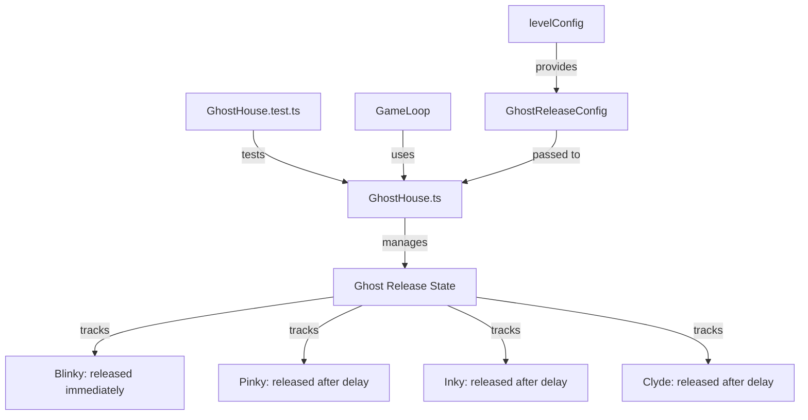

# Junior Python Developer Mission Report — ASSIGN-014

**Agent**: junior-python  
**Generated**: 2026-08-19T15:10:47.537Z

---

## Branch: pacmanclaude4/pacman/feature/us-006-012-ghost-ai

## Assignment: ASSIGN-014

## Files Changed

- **created** `src/engine/GhostHouse.test.ts` — Created comprehensive unit tests for GhostHouse staggered ghost release logic. Tests verify: [US-008#1] only Blinky releases immediately, [US-008#2] ghosts release in deterministic order (Blinky->Pinky->Inky->Clyde) with configured delays, [US-008#3] release order and delays are reproducible. Includes tests for edge cases, custom delays, and reset functionality.

## Notes

The GhostHouse.ts implementation was completed in the previous generation. This test file validates the staggered ghost release logic by testing: (1) initial state with only Blinky released, (2) sequential release of Pinky, Inky, and Clyde after their configured delays, (3) reproducibility of release order and timing, (4) handling of large tick values crossing multiple boundaries, (5) custom release delays from level config, and (6) reset functionality for new levels/lives. All tests follow the naming convention [US-008#<acIndex>] to map to acceptance criteria.

## Diagram

