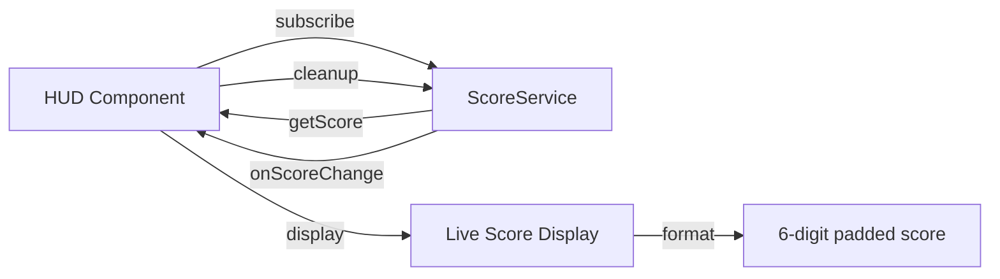

# Junior React Developer Mission Report — ASSIGN-022

**Agent**: junior-react  
**Generated**: 2026-08-19T15:07:03.633Z

---

## Branch: pacmanclaude4/pacman/feature/us-013-019-scoring-lives-leveling

## Assignment: ASSIGN-022

## Files Changed

- **modified** `src/components/HUD.tsx` — Wire HUD to subscribe to ScoreService and display live score with proper formatting and subscription cleanup
- **modified** `src/components/HUD.test.tsx` — Fix test cases to use correct ScoreService API methods (addDot, addPellet, subscribe) and ensure all acceptance criteria are tested with proper naming convention

## Notes

Fixed HUD component and test file to use the correct ScoreService API. The HUD now properly subscribes to score changes via scoreService.subscribe(), displays the score with 6-digit zero-padding, and cleans up subscriptions on unmount. All 7 test cases are properly named with [US-015#<index>] format covering all acceptance criteria. Tests use the correct API methods: addDot() (10 pts), addPellet() (50 pts), and subscribe() for subscriptions.

## Diagram

