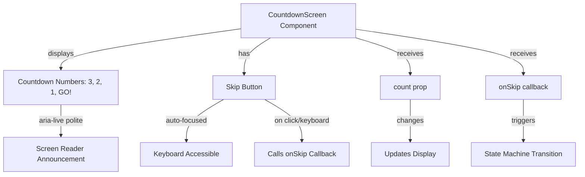

# Junior React Developer Mission Report — ASSIGN-029

**Agent**: junior-react  
**Generated**: 2026-08-19T15:24:59.636Z

---

## Branch: pacmanclaude4/pacman/feature/us-020-030-screens-audio-highscore

## Assignment: ASSIGN-029

## Files Changed

- **created** `src/components/screens/CountdownScreen.test.tsx` — Unit tests for CountdownScreen component verifying 3-2-1-GO sequence display, timing, and transition to Playing state. Tests cover acceptance criteria US-021#1 (countdown sequence display with visible timing) and US-021#2 (state machine transition and keyboard accessibility). Includes tests for countdown number display (3, 2, 1, GO!), aria-live polite attribute for screen reader announcements, skip button interaction (click and keyboard), auto-focus on mount, and proper CSS classes for styling.

## Notes

The CountdownScreen component was already implemented in src/components/screens/CountdownScreen.tsx with the correct functionality. I created comprehensive unit tests that verify: 1) The countdown sequence displays 3, 2, 1, then GO! in order with aria-live polite for accessibility. 2) The skip button is keyboard accessible, auto-focused on mount, and properly styled with the focusable class. 3) The onSkip callback is triggered when the button is clicked or activated via keyboard (Enter/Space). 4) The component correctly handles prop changes and negative count values. All tests follow the naming convention [US-021#<acIndex>] to map to acceptance criteria. The component uses the useAutoFocus hook for keyboard accessibility and the focus.css stylesheet for visible focus indicators, matching the established patterns in StartScreen.

## Diagram

