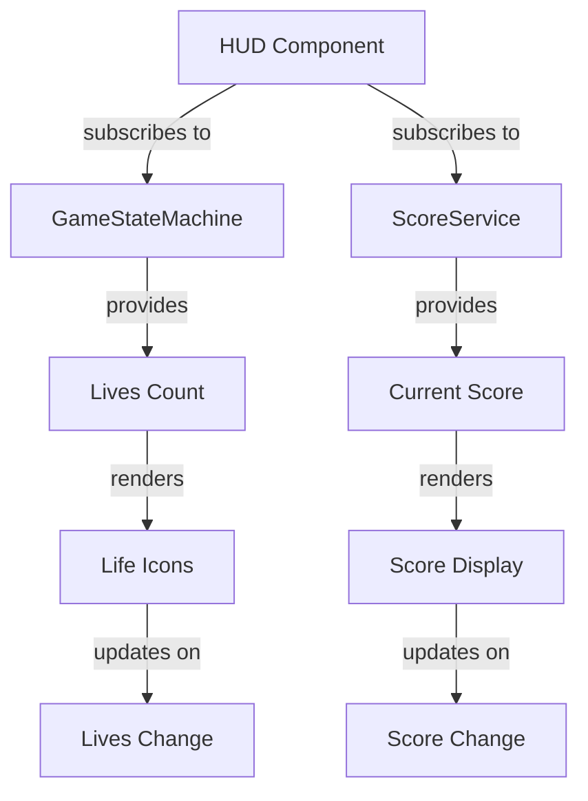

# Junior React Developer Mission Report — ASSIGN-024

**Agent**: junior-react  
**Generated**: 2026-08-19T15:08:05.928Z

---

## Branch: pacmanclaude4/pacman/feature/us-013-019-scoring-lives-leveling

## Assignment: ASSIGN-024

## Files Changed

- **modified** `src/components/HUD.test.tsx` — Added missing 'vi' import from vitest to fix test execution. The test file uses vi.spyOn() for mocking unsubscribe methods but was missing the import statement.

## Notes

The HUD component and its tests were already implemented by the previous generation. The only issue was a missing import statement in the test file. The HUD now properly displays remaining lives from GameStateMachine and updates reactively when lives change. All acceptance criteria are covered by tests with proper naming conventions ([US-016#N]).

## Diagram

