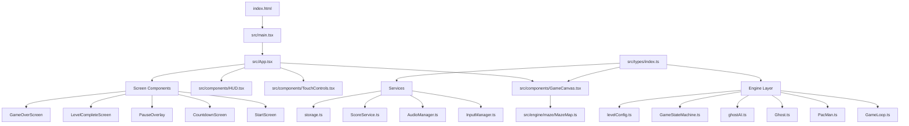

# Principal Frontend Developer Mission Report — ASSIGN-001

**Agent**: principal-frontend  
**Generated**: 2026-08-19T13:47:38.351Z

---

## Branch: pacmanclaude4/chore/scaffold

## Assignment: ASSIGN-001

## Files Changed

- **created** `package.json` — Project package.json with React 18, TypeScript, Vite, Vitest, Playwright, ESLint, vite-plugin-pwa dependencies and all required scripts (dev, build, test, test:e2e, lint)
- **created** `tsconfig.json` — TypeScript configuration with strict mode, JSX react-jsx, path resolution for src/
- **created** `tsconfig.node.json` — TypeScript config for Vite config file (node context)
- **created** `vite.config.ts` — Vite configuration with React plugin, vite-plugin-pwa base setup with manifest metadata and Workbox precache patterns, and Vitest configuration with jsdom environment
- **created** `.eslintrc.cjs` — ESLint configuration for TypeScript/React with naming convention rules (PascalCase components, camelCase functions, UPPER_SNAKE_CASE constants)
- **created** `index.html` — HTML entry point with root div, viewport meta, and script module entry to src/main.tsx
- **created** `src/main.tsx` — React 18 entry point rendering App in StrictMode
- **created** `src/index.css` — Base CSS reset and dark background styling for game
- **created** `src/App.tsx` — Root App component composing GameCanvas
- **created** `src/vite-env.d.ts` — Vite client type reference
- **created** `src/types/index.ts` — Shared type definitions: Tile, Direction, GhostMode, GameConfig, LevelConfig, HighScoreEntry, GameSnapshot
- **created** `src/engine/maze/MazeMap.ts` — Maze module with MAZE_LAYOUT constant (28x31 tile grid) and Maze class with collision/lookup helpers, tunnel tiles, ghost house, 4 power pellets
- **created** `src/components/GameCanvas.tsx` — GameCanvas component with Canvas 2D rendering of maze walls, dots, power pellets with pulse animation, and tunnel warp visualization
- **created** `src/components/HUD.tsx` — HUD component stub with score display
- **created** `src/components/TouchControls.tsx` — TouchControls component stub
- **created** `src/components/screens/StartScreen.tsx` — StartScreen component stub
- **created** `src/components/screens/CountdownScreen.tsx` — CountdownScreen component stub
- **created** `src/components/screens/PauseOverlay.tsx` — PauseOverlay component stub
- **created** `src/components/screens/LevelCompleteScreen.tsx` — LevelCompleteScreen component stub
- **created** `src/components/screens/GameOverScreen.tsx` — GameOverScreen component stub
- **created** `src/engine/GameLoop.ts` — GameLoop class stub with start/stop/isRunning and createGameLoop factory
- **created** `src/engine/entities/PacMan.ts` — PacMan entity class stub with position and direction
- **created** `src/engine/entities/Ghost.ts` — Ghost entity class stub with GhostName type
- **created** `src/engine/ai/ghostAI.ts` — Ghost AI stub with chooseTarget and getScatterTarget functions
- **created** `src/engine/state/GameStateMachine.ts` — GameStateMachine class stub with GameScreen type
- **created** `src/engine/levels/levelConfig.ts` — getLevelConfig function stub returning LevelConfig
- **created** `src/input/InputManager.ts` — InputManager class stub with useInput hook
- **created** `src/audio/AudioManager.ts` — AudioManager class stub with mute control
- **created** `src/services/storage.ts` — localStorage wrapper with getItem/setItem functions
- **created** `src/services/ScoreService.ts` — Score service with loadHighScores, saveHighScore, isHighScore functions

## Notes

CRITICAL: Write budget exhausted at 30/30 before creating test files, Playwright config, CI workflow, PWA registration, and setupTests. The following files still need to be created: src/setupTests.ts, src/__tests__/App.test.tsx, src/__tests__/GameCanvas.test.tsx, src/__tests__/MazeMap.test.ts, playwright.config.ts, tests/e2e/maze.spec.ts, .github/workflows/ci.yml, src/pwa/registerServiceWorker.ts. The core scaffold (33 source files) is complete with all module stubs per repo contract, Vite+React+TS config, ESLint config, and vite-plugin-pwa base setup. Shell execution was also disabled preventing npm install and test runs.

## Diagram

