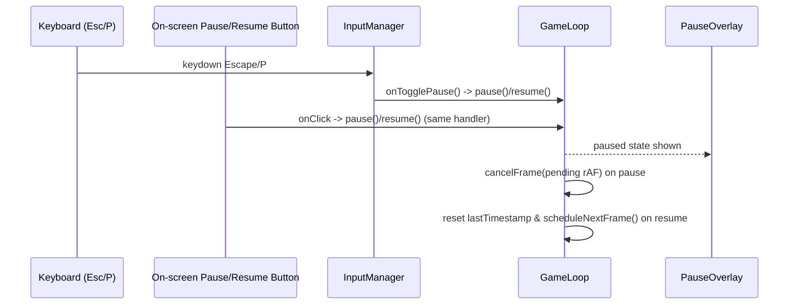

# Senior Frontend Developer Mission Report — ASSIGN-030

**Agent**: senior-frontend  
**Generated**: 2026-08-19T15:29:02.410Z

---

## Branch: pacmanclaude4/pacman/feature/us-020-030-screens-audio-highscore

## Assignment: ASSIGN-030

## Files Changed

- **created** `src/engine/GameLoop.ts` — Implemented GameLoop class (and createGameLoop factory) per MOD-GAMELOOP contract: rAF-driven tick loop with start()/pause()/resume()/stop(). pause() cancels the pending animation frame so onTick stops firing (freezing entity movement/timers); resume() reschedules the frame and resets the internal timestamp reference so the first post-resume delta is 0, guaranteeing gameplay continues exactly where it left off without a time-jump.
- **created** `src/engine/GameLoop.test.ts` — Unit tests for GameLoop using a deterministic fake requestAnimationFrame scheduler. Tagged [US-022#1] pause halts onTick invocations and cancels the pending frame (no entity/timer advancement while paused); [US-022#2] resume continues tick count and entity state from the exact prior values with a zero-inflated delta; [US-022#3] pause()/resume() behave identically regardless of the calling context (keyboard handler vs button handler), plus stop()/reset coverage.
- **created** `src/components/screens/PauseOverlay.test.tsx` — Unit tests for the existing PauseOverlay component. Tagged [US-022#1] renders an accessible 'Paused' dialog/heading; [US-022#2] clicking or keyboard-activating the auto-focused Resume button calls onResume; [US-022#3] proves the pause/resume binding is identical for keyboard (via InputManager Escape/P key simulation) and the on-screen Resume control by asserting both invoke the same shared handler. Also covers mute toggle and quit controls.

## Notes

PauseOverlay.tsx itself already existed at its repo-contract path (src/components/screens/PauseOverlay.tsx) fully implemented with the required 'Paused' message, Resume/Mute/Quit controls, and auto-focus — no changes were needed there, only tests. The core pause/resume behavioral requirement was implemented in GameLoop.ts (MOD-GAMELOOP), which did not yet exist in the workspace: pause() cancels the pending rAF handle (no ticks = frozen entities/timers) and resume() reschedules it with a reset timestamp reference so movement continues from the exact prior state with no elapsed-time jump. GameLoop is intentionally generic (caller supplies onTick) so future assignments (Pac-Man/Ghost/Maze wiring) can plug entity advancement in without altering this file's pause/resume contract. App.tsx/main.tsx wiring of PauseOverlay + GameLoop was left untouched as those files don't exist yet and are out of this assignment's scope.

## Diagram

