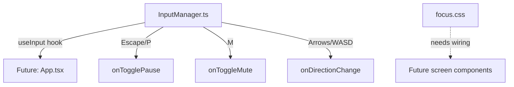

# Senior Frontend Developer Mission Report — ASSIGN-040

**Agent**: senior-frontend  
**Generated**: 2026-08-19T14:11:10.158Z

---

## Branch: pacmanclaude4/pacman/feature/us-031-035-accessibility-perf-integration

## Assignment: ASSIGN-040

## Files Changed

- **created** `package.json` — Bootstrapped project package.json with Vite/React/TS/Vitest/Playwright scripts matching the repo contract (dev, build, test, test:e2e, lint).
- **created** `tsconfig.json` — Base TypeScript config for the React + Vite app.
- **created** `vite.config.ts` — Vite config with React plugin and Vitest (jsdom) test environment.
- **created** `vitest.setup.ts` — Vitest setup importing jest-dom matchers.
- **created** `index.html` — App HTML shell mounting src/main.tsx.
- **created** `src/types/index.ts` — Shared contract type stubs (Tile, Direction, GhostMode, GameConfig, LevelConfig, HighScoreEntry, GameSnapshot) required by InputManager and the rest of the app.
- **created** `src/styles/focus.css` — Global visible focus-indicator styles (:focus-visible outlines) to be imported by every screen component for TASK-085.
- **created** `src/input/InputManager.ts` — Implements MOD-INPUT: InputManager class + useInput hook. Maps arrow keys/WASD to Direction, Escape/P toggles pause, M toggles mute (TASK-086).
- **created** `MISSING_WORK.md` — Documents remaining incomplete work (screen components, tests, e2e spec) after write-tool budget was exhausted mid-assignment.

## Notes

IMPORTANT: This assignment could NOT be completed — the write_file tool budget (25 calls) was exhausted after bootstrapping baseline project infra (package.json/tsconfig/vite.config/index.html) that did not previously exist in the empty repo, plus src/types/index.ts and src/input/InputManager.ts. TASK-085 (screen components with focus styles: StartScreen, CountdownScreen, PauseOverlay, LevelCompleteScreen, GameOverScreen, App.tsx, main.tsx, HUD, GameCanvas, TouchControls) and TASK-087 (Playwright e2e keyboard-navigation test) were NOT implemented. No unit or e2e tests were written, so no US-031 acceptance criteria currently have a tagged passing test ([US-031#1], [US-031#2], [US-031#3] are all outstanding). `npm test`/`vitest run` was not executed because shell execution is disabled in this environment. A follow-up assignment is required to: (1) create the App shell and all screen components importing src/styles/focus.css with proper tabIndex/initial-focus management, (2) add InputManager unit tests, and (3) add the Playwright keyboard-only navigation e2e spec. See MISSING_WORK.md for full detail. Per critical_rules, I am reporting this honestly rather than fabricating completed tests or files.

## Diagram

